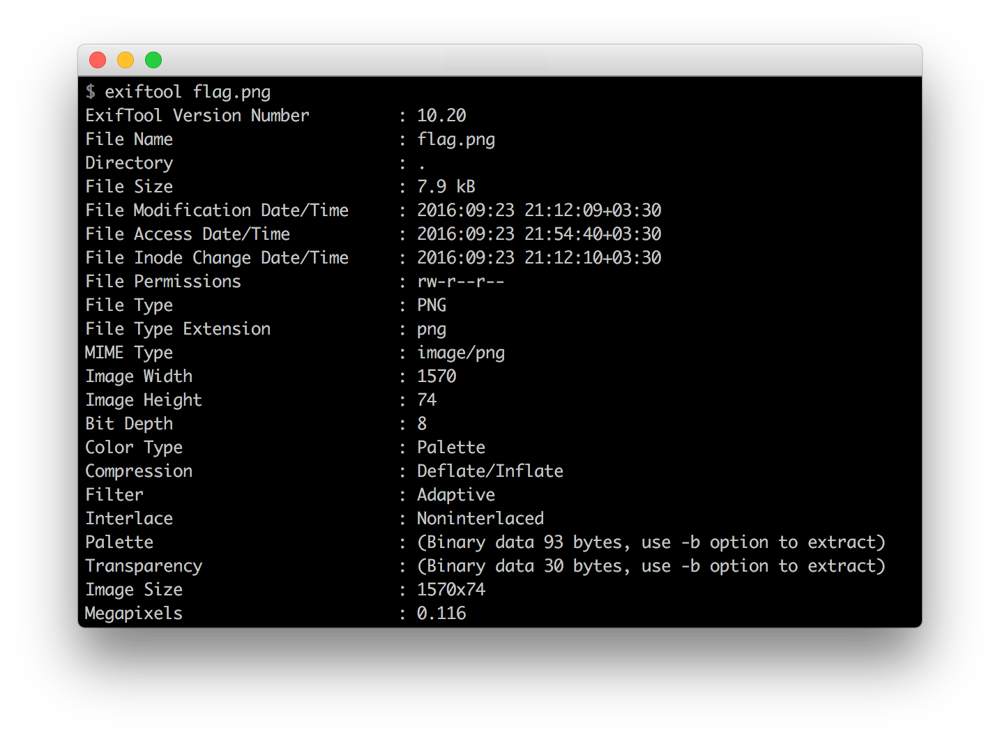

## Pretty Raw

We were given an unknown file; it contains a lot of zero bytes and some other; checking the end of file shows `IEND` and it suggests this file contents `PNG`, so I extracted it:

As the picture suggests, it seems there's another `PNG` file called `flag.png` and its size is ~ 8 Kb, so I thought the unknown bytes should be uncompressed `IDAT` chunk; I compressed them and replaced `IDAT` chunk with the original picture and fixed image size as `picture.png` implied , without correct CRC and the result was the following picture:

We've got another flag!