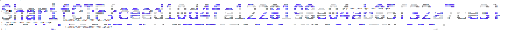

##Synced

There are about 3 floppy images in the `pcap`; We extracted some pictures from that and fixed them but found no flag.
There is a suspicious pattern at the end of the file; Seems like a colorful Linux terminal output.
We cut that part and `cat` in terminal and got the flag

