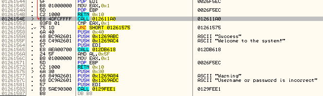
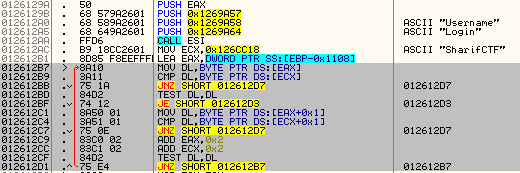
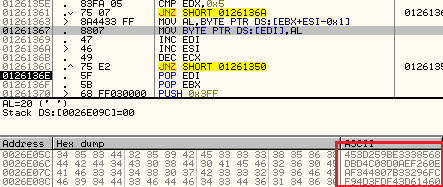
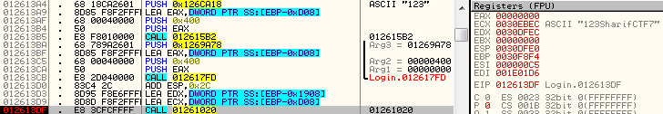
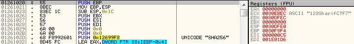

## Find Login

We were given a 32-bit executable VMProtected file and an ini file which contains this section:

```
[Login]
Username=SharifCTF
Password=16074598B43D002C25E5719B4CC6E3AB0233F56285C92668CBA3DB7FF8D4138DC0D8738D4B830A520EEF2E432624760E5273AFC1E03409A948323A07FCCFB3C2923212C8965B3FFCD028F95EEC4D2F4F3FDE63DFFDD243B2C6D6B1A4142C97604F35
```

As you can see the username is plain and we just need to find the password. So I tried to debug  and find it:



Here is username comparison:



Hash cleanup:



And get the correct hash:

```
453d259be3338568dbd4c08d0aef260eaf344807b33296fcf94d3fdf43d61460
```

Continue tracing until this call:



I was using `123` as the password and you can see it’s concatenated to `SharifCTF7` as salt and inside it you can see it uses `SHA256` to generate our hash. So I have to crack it:



```
SHA256(PASSWORD+"SharifCTF7") == "453d259be3338568dbd4c08d0aef260eaf344807b33296fcf94d3fdf43d61460"
```

`Hashcat` plus `rockyou.txt` helps us to find the password and it was `147467`.