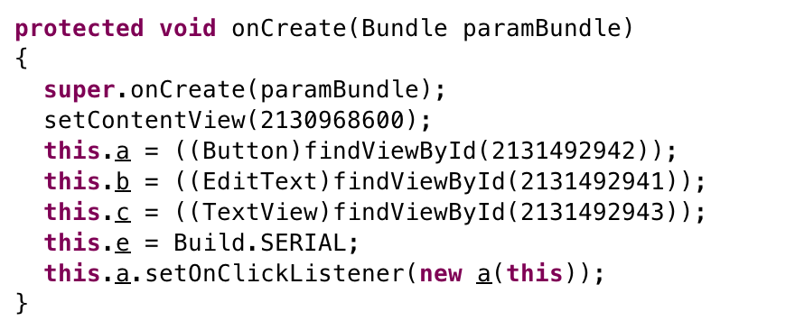
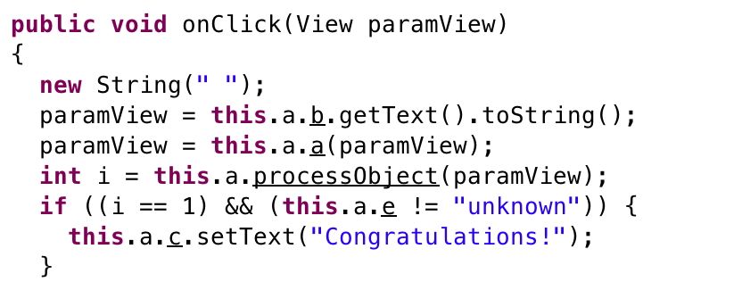
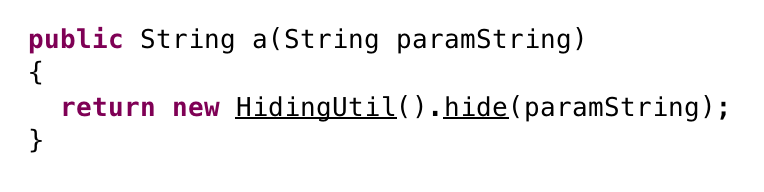
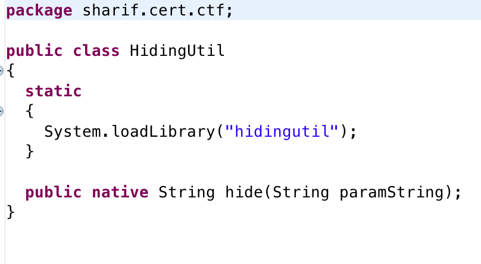
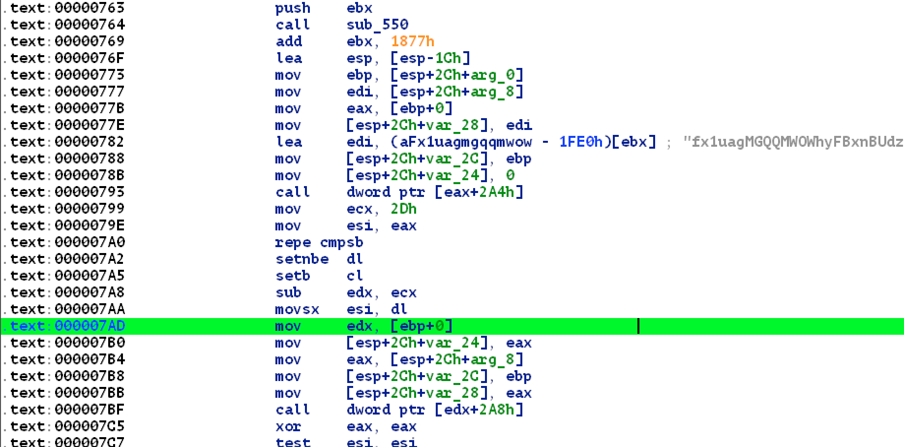
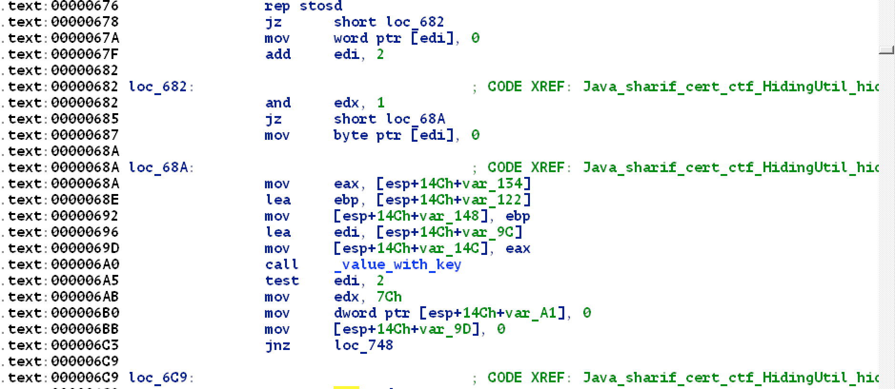

We were given an apk (Login.apk). using dex2jar + jd we can see decompiled code of the apk.  
```
$ d2j-dex2jar Login.apk
dex2jar Login.apk -> ./Login-dex2jar.jar
```

In MainActivity class we have following onCreate method:  


this.a is a Button and last line set a listener `a` class on it:  


We are interested in (i==1 & (this.a.e != “unknown”)). the second part is not necessary since it is initialized with Build.SERIAL. So we are dealing with (i==1):  
```
paramView = this.a.a(paramView);
```
this.a is MainActivity class and this.a.a is:   


According to HidingUtil we have following code:  


So hidingutil library is important to us. besides we have following line:   
```
int i = this.a.processObject(paramView);
```

and we can see processObject is also a hidingUtil library function.  

Let’s disassemble libhidingutil.so:  

```
$ unzip Login.apk lib/x86/libhidingutil.so 
```

processObject disassembly:  



and its psuedo code:  
```
int Java_sharif_cert_ctf_MainActivity_processObject(char *input)
{
	char *out = "fx1uagMGQQMWOWhyFBxnBUdzN35NPWYHUBQHRmozeEY=";
	int len = 45;
	char *ptr = input;
	int check = 0;
	do
	{
		if (!len)
			break;
		check = *ptr++ == *out++;
		len--;

	} while (check);
	return check == 0;
}
```

HidingUtil_hide disassembly:  


after cleaning function and removing unnecessary parts we have following pseudo code:  
```
void value_with_key(inb, outb)
{
	char *aMy_s3cr3t_p_W0 = "My_S3cr3t_P@$$W0rD"; // .rodata
	char l;
	int idx = 0;
	for (l=inb[0]; l; l = inb[idx])
	{
		out[idx] = aMy_s3cr3t_p_W0[idx % 0x13] ^ l;
		idx++;
	}
	return;
}

char *Java_sharif_cert_ctf_HidingUtil_hide(char *input)
{
	char out[33];
	value_with_key(input, out);
	char *rv = Base64Encode(out);
	return rv;
}
```

So what is we should solve is:   
```
Java_sharif_cert_ctf_MainActivity_processObject(Java_sharif_cert_ctf_HidingUtil_hide(“flag”)) == 1;
```

And our solver code:  
```
#!/usr/bin/python

a = "fx1uagMGQQMWOWhyFBxnBUdzN35NPWYHUBQHRmozeEY="
pw = "My_S3cr3t_P@$$W0rD\x00"
print len(pw)
a = a.decode("base64")

b = ""
i = 0
for c in a:
    b += chr(0xff & (ord(c) ^ ord(pw[i % 0x13])))
    i += 1

print "flag:", b
```