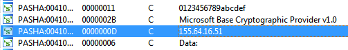
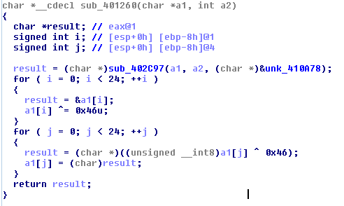
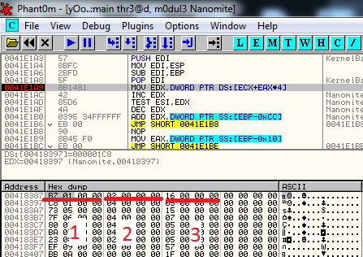
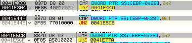

## Nanomites

We were given a 32-bit execuable file and as the file name suggests, it uses `Nanomites` technology; As you know or maybe not, `Nanomites` is a modern anti-debug method which first was used by `Armadillo`; In short `Nanomites` replaces branchs with `0xcc` (INT_3), then creates a child process and attaches it (which calls debug block method which used by `Armadillo` for the first time) and controls the flow of the execution, then anytime `INT_3` occurs, the parent child fetches thread information and finds the match in `Nanomites` table and changes the flow to prevent crash and the program works fine.
In our tasks, parent process creates a child and the child starts debugging the parent. It aslo uses some anti-debug APIs like `IsDebuggerPresent`, `CheckRemoteDebuggerPresent` and some others wich I can't remember while writing this writeup!
Another method was CRC check which checks file checksum and prevents running if it doesn't match the hard-coded one; And the other is ASLR. OK what we do? Actully the organizers implemented these methods weakly and the code was completely naked; we just need a disassembler to find the flag. All we needed was the `IP` address and the data which is sent to the server; The `IP` part was the simple part because we need to search for strings and find it as you see in the following picture:



And the other thing was plain-text of encrypted data which it was  too simple to find: just search for `Encrypted_` and above of it you will find decryption routine which is simple XOR:



OK, so after the competitions ended, I spent my free time on this to fix `Nanomites` which never completed but for those who want to continue, you have to disable ASLR, then you need to fix CRC check following this sequence of bytes:

```
0F 84 1B 00 00 00 85 C0 BA 00 00 00 00 8B F6 3B F7 F7 D2 50 C1 E8 11 48 85 C6
```

Change it to `EBFE` which means jump to itself, hence making a loop. Later you can fix it after attaching to it; Changing `EBFE` to jump bypasses CRC check.Then we set a bp on `CreateProcess` and continue after step out, when the child process is created, we attach to it and fix CRC check jump and detach from parent process, and set bp on `WaitForDebugEvent` to find Nanomites table which you can find it on `00418387` and for the first time you meet him at:

```
0041E1A9    8B1481          MOV EDX,DWORD PTR DS:[ECX+EAX*4]
```



1) Offset
2) Branch type
3) Destination

In offset+0x401000 you can find int3 instructions which needs to be fixed, destination+(number of opcodes of offset) is the correct path to jump, and the branch types operation can find at `0041E300`; find the rest by continue tracing...



After you understand all these parts you can write you own `ollydbg script` and use its script plugin to fix the file and fix the OEP and done!

And a big thank you goes to `Raham` for helping me in this challenge
