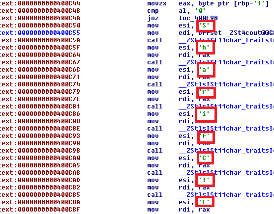

## SCrack
We were given a 64-bit executable, it uses ptrace to detect tracing, it's easy to bypass this test but we don't need that actually, static analysis shows the flag, just check VA 0x400C50 and convert each hexadecimal value to its character code to get the flag...!

