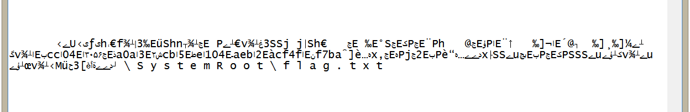
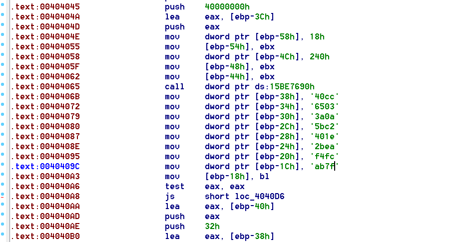

##Unloadme

Unload me correctly and capture the flag!

We can use tools like OSRLoader to install a driver and work on it.
It seems the file is protected using `Safengine (NoobyProtect SE 1.7.0.0)`
But we didn't want to miss its bonus points.
So we opened it in Notepad and got the flag; too easy

The most important part is not touched by the protector engine!

`SharfiCTF{cc043056a0a32cb5e104aeb2cf4ff7ba}`

240 points in 30 seconds!
Bad design or too much points?!